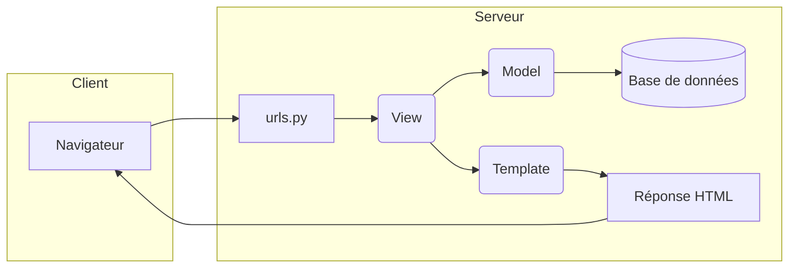
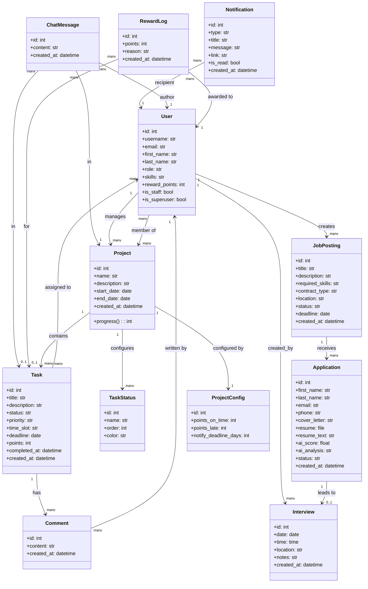
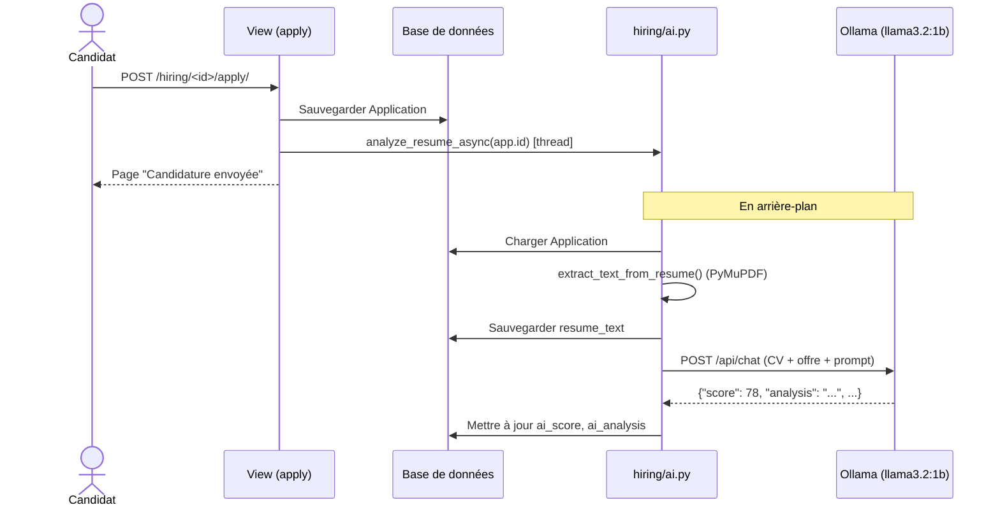
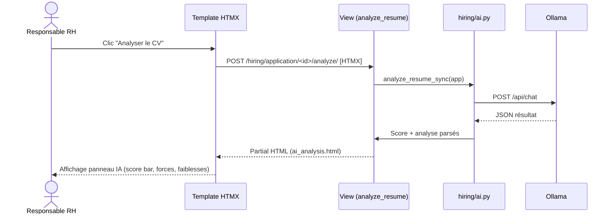
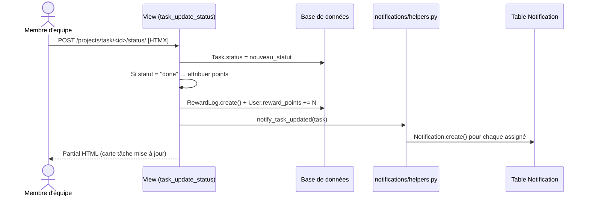
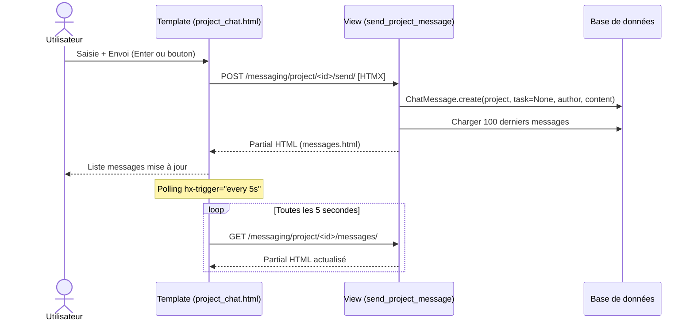
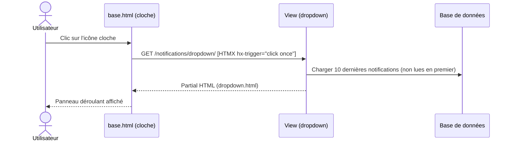

# Document de Conception — Système ERP
## Module Recrutement & Gestion de Projets

**Réalisé par :** CHERGUI Moad  
**Organisme :** Harmony Technology  
**Année :** 2025–2026

---

## Table des matières

1. [Rappel du contexte](#1-rappel-du-contexte)  
2. [Stack technologique retenu](#2-stack-technologique-retenu)  
3. [Architecture logicielle](#3-architecture-logicielle)  
4. [Description des modules](#4-description-des-modules)  
5. [Diagramme de classes](#5-diagramme-de-classes)  
6. [Schéma de base de données](#6-schéma-de-base-de-données)  
7. [Diagrammes de séquence](#7-diagrammes-de-séquence)  
8. [Architecture des URLs](#8-architecture-des-urls)  
9. [Composants IA](#9-composants-ia)  
10. [Contrôle d'accès (RBAC)](#10-contrôle-daccès-rbac)

---

## 1. Rappel du contexte

Le système ERP développé répond aux besoins suivants :

- **Module Recrutement** : publication d'offres, candidatures en ligne, analyse IA des CV, planification d'entretiens.
- **Module Gestion de Projets** : création de projets, gestion de tâches (Kanban/Scrum), affectation d'équipes, messagerie intégrée, notifications, système de récompenses.

---

## 2. Stack technologique retenu

| Couche                        | Technologie                                      |
| ----------------------------- | ------------------------------------------------ |
| **Backend**                   | Django 5.x (architecture MVT)                    |
| **Frontend**                  | HTMX + Tailwind CSS                              |
| **Base de données**           | SQLite (développement) → PostgreSQL (production) |
| **Stockage fichiers**         | Système de fichiers local (`media/`)             |
| **Intelligence Artificielle** | Ollama (modèle `llama3.2:1b`, local)             |
| **Extraction PDF**            | PyMuPDF (`fitz`)                                 |
| **Notifications**             | Polling HTMX + base de données                   |
| **Messagerie**                | Polling HTMX (toutes les 5s)                     |
| **Authentification**          | Sessions Django (CSRF, hachage bcrypt)           |
| **Versionning**               | Git / GitHub                                     |

---

## 3. Architecture logicielle

Le projet suit le patron **MVT (Model – View – Template)** de Django.

```
ERP_System/                  ← Projet Django
├── accounts/                ← Gestion des utilisateurs & rôles
├── hiring/                  ← Module Recrutement
├── projects/                ← Module Gestion de Projets
├── notifications/           ← Système de notifications
├── messaging/               ← Messagerie de projet/tâche
├── templates/               ← Templates HTML globaux
│   ├── base.html
│   ├── accounts/
│   ├── hiring/
│   ├── projects/
│   ├── notifications/
│   └── messaging/
├── static/                  ← CSS, JS, images
├── media/                   ← Fichiers uploadés (CV, avatars)
└── ERP_System/
    ├── settings.py
    ├── urls.py
    └── wsgi.py
```

### Flux de requête (MVT)



---

## 4. Description des modules

### 4.1 `accounts` — Gestion des utilisateurs

- Modèle `User` personnalisé (hérite de `AbstractUser`)
- Rôles : `admin`, `hr_manager`, `project_manager`, `team_member`
- Champs additionnels : `role`, `skills`, `avatar`, `reward_points`, `department`
- Modèle `Department` : les employés sont organisés par département (FK nullable sur `User`)
- Décorateur `@role_required(*roles)` pour la protection des vues
- Vues : `login`, `logout`, `register`, `profile`

### 4.2 `hiring` — Recrutement

- Gestion des offres d'emploi (`JobPosting`) par le RH
- Formulaire public de candidature (sans authentification)
- Stockage des CV (PDF, DOCX, TXT) dans `media/resumes/`
- Extraction du texte du CV via PyMuPDF
- Analyse IA à la soumission (asynchrone en thread) + à la demande (HTMX)
- Planification d'entretiens

### 4.3 `projects` — Gestion de projets

- Projets avec dates, description, manager et membres (M2M)
- Statuts de tâches configurables par projet (`TaskStatus` — colonnes Kanban)
- Tâches assignées à plusieurs membres, avec priorité, créneau (matin/après-midi), deadline
- Vues Kanban et Scrum
- Vue Membre (tâches par membre) et Vue Tâche (membres par tâche)
- Commentaires sur les tâches
- Système de récompenses : `RewardLog`, points configurables via `ProjectConfig`
- Suggestion IA d'affectation de tâches

### 4.4 `notifications` — Notifications

- Modèle `Notification` avec types : `task_assigned`, `task_updated`, `deadline`, `application`, `interview`, `reward`
- Création via helpers (`notify_task_assigned`, `notify_task_updated`, etc.)
- Dropdown HTMX dans la barre de navigation (chargement lazy)
- Marquage lu/non-lu

### 4.5 `messaging` — Messagerie

- Modèle `ChatMessage` lié à un `Project` et optionnellement à une `Task`
- Chat de groupe par projet (messages sans tâche)
- Sous-groupe de discussion par tâche
- Polling automatique toutes les 5 secondes via HTMX
- Accès restreint aux membres et managers du projet

---

## 5. Diagramme de classes



---

## 6. Schéma de base de données

### Table `accounts_department`

| Colonne       | Type         | Description                |
| ------------- | ------------ | -------------------------- |
| `id`          | INTEGER PK   | Identifiant                |
| `name`        | VARCHAR(100) | Nom du département (unique) |
| `description` | TEXT         | Description                |
| `created_at`  | DATETIME     | Date de création           |

### Table `accounts_user`

| Colonne          | Type                    | Description                                                |
| ---------------- | ----------------------- | ---------------------------------------------------------- |
| `id`             | INTEGER PK              | Identifiant                                                |
| `username`       | VARCHAR(150)            | Nom d'utilisateur (unique)                                 |
| `email`          | VARCHAR(254)            | Email                                                      |
| `first_name`     | VARCHAR(150)            | Prénom                                                     |
| `last_name`      | VARCHAR(150)            | Nom                                                        |
| `role`           | VARCHAR(20)             | `admin` / `hr_manager` / `project_manager` / `team_member` |
| `skills`         | TEXT                    | Compétences (virgule-séparées)                             |
| `avatar`         | VARCHAR(255)            | Chemin de l'image de profil                                |
| `department_id`  | INTEGER FK→Department  | Département (nullable)                                    |
| `reward_points`  | INTEGER                 | Points cumulés                                             |
| `password`       | VARCHAR(128)            | Hash bcrypt                                                |
| `is_staff`       | BOOLEAN                 | Accès admin Django                                         |
| `is_superuser`   | BOOLEAN                 | Super administrateur                                       |

### Table `hiring_jobposting`

| Colonne           | Type            | Description                                 |
| ----------------- | --------------- | ------------------------------------------- |
| `id`              | INTEGER PK      | —                                           |
| `title`           | VARCHAR(200)    | Titre du poste                              |
| `description`     | TEXT            | Description du poste                        |
| `required_skills` | TEXT            | Compétences requises                        |
| `contract_type`   | VARCHAR(20)     | `cdi` / `cdd` / `stage` / `freelance`       |
| `location`        | VARCHAR(200)    | Lieu                                        |
| `status`          | VARCHAR(20)     | `draft` / `published` / `paused` / `closed` |
| `deadline`        | DATE            | Date limite                                 |
| `created_by_id`   | INTEGER FK→User | Créateur                                    |

### Table `hiring_application`

| Colonne        | Type                  | Description                                                    |
| -------------- | --------------------- | -------------------------------------------------------------- |
| `id`           | INTEGER PK            | —                                                              |
| `job_id`       | INTEGER FK→JobPosting | Offre concernée                                                |
| `first_name`   | VARCHAR(100)          | Prénom candidat                                                |
| `last_name`    | VARCHAR(100)          | Nom candidat                                                   |
| `email`        | VARCHAR(254)          | Email                                                          |
| `phone`        | VARCHAR(20)           | Téléphone                                                      |
| `cover_letter` | TEXT                  | Lettre de motivation                                           |
| `resume`       | VARCHAR(255)          | Chemin du fichier CV                                           |
| `resume_text`  | TEXT                  | Texte extrait du CV                                            |
| `ai_score`     | REAL                  | Score IA (0–100)                                               |
| `ai_analysis`  | TEXT                  | Analyse IA brute (JSON)                                        |
| `status`       | VARCHAR(20)           | `pending` / `reviewed` / `interview` / `accepted` / `rejected` |

### Table `hiring_interview`

| Colonne          | Type                   | Description         |
| ---------------- | ---------------------- | ------------------- |
| `id`             | INTEGER PK             | —                   |
| `application_id` | INTEGER FK→Application | —                   |
| `date`           | DATE                   | Date de l'entretien |
| `time`           | TIME                   | Heure               |
| `location`       | VARCHAR(200)           | Lieu / lien visio   |
| `notes`          | TEXT                   | Notes               |
| `created_by_id`  | INTEGER FK→User        | —                   |

### Table `projects_project`

| Colonne       | Type            | Description    |
| ------------- | --------------- | -------------- |
| `id`          | INTEGER PK      | —              |
| `name`        | VARCHAR(200)    | Nom            |
| `description` | TEXT            | Description    |
| `start_date`  | DATE            | Début          |
| `end_date`    | DATE            | Fin            |
| `manager_id`  | INTEGER FK→User | Chef de projet |

### Table `projects_project_members` *(M2M)*

| Colonne      | Type       |
| ------------ | ---------- |
| `project_id` | FK→Project |
| `user_id`    | FK→User    |

### Table `projects_taskstatus`

| Colonne      | Type               | Description                   |
| ------------ | ------------------ | ----------------------------- |
| `id`         | INTEGER PK         | —                             |
| `project_id` | INTEGER FK→Project | —                             |
| `name`       | VARCHAR(100)       | Nom du statut (ex: "À faire") |
| `order`      | INTEGER            | Position dans le Kanban       |
| `color`      | VARCHAR(20)        | Couleur (hex)                 |

### Table `projects_task`

| Colonne        | Type               | Description                          |
| -------------- | ------------------ | ------------------------------------ |
| `id`           | INTEGER PK         | —                                    |
| `project_id`   | INTEGER FK→Project | —                                    |
| `title`        | VARCHAR(200)       | Titre                                |
| `description`  | TEXT               | Description                          |
| `status`       | VARCHAR(50)        | Statut courant                       |
| `priority`     | VARCHAR(10)        | `low` / `medium` / `high` / `urgent` |
| `time_slot`    | VARCHAR(10)        | `morning` / `afternoon`              |
| `deadline`     | DATE               | Échéance                             |
| `points`       | INTEGER            | Points de récompense                 |
| `completed_at` | DATETIME           | Date de complétion                   |

### Table `projects_task_assigned_to` *(M2M)*

| Colonne   | Type    |
| --------- | ------- |
| `task_id` | FK→Task |
| `user_id` | FK→User |

### Table `projects_comment`

| Colonne      | Type            | Description |
| ------------ | --------------- | ----------- |
| `id`         | INTEGER PK      | —           |
| `task_id`    | INTEGER FK→Task | —           |
| `author_id`  | INTEGER FK→User | —           |
| `content`    | TEXT            | Contenu     |
| `created_at` | DATETIME        | —           |

### Table `projects_rewardlog`

| Colonne   | Type                       | Description      |
| --------- | -------------------------- | ---------------- |
| `id`      | INTEGER PK                 | —                |
| `user_id` | INTEGER FK→User            | Bénéficiaire     |
| `task_id` | INTEGER FK→Task (nullable) | Tâche concernée  |
| `points`  | INTEGER                    | Points attribués |
| `reason`  | VARCHAR(200)               | Motif            |

### Table `projects_projectconfig`

| Colonne                | Type                        | Description                     |
| ---------------------- | --------------------------- | ------------------------------- |
| `id`                   | INTEGER PK                  | —                               |
| `project_id`           | INTEGER FK→Project (unique) | 1-to-1                          |
| `points_on_time`       | INTEGER                     | Points si livré dans les délais |
| `points_late`          | INTEGER                     | Points si livré en retard       |
| `notify_deadline_days` | INTEGER                     | Alerter N jours avant deadline  |

### Table `notifications_notification`

| Colonne        | Type            | Description                                                                            |
| -------------- | --------------- | -------------------------------------------------------------------------------------- |
| `id`           | INTEGER PK      | —                                                                                      |
| `recipient_id` | INTEGER FK→User | Destinataire                                                                           |
| `type`         | VARCHAR(20)     | `task_assigned` / `task_updated` / `deadline` / `application` / `interview` / `reward` |
| `title`        | VARCHAR(200)    | Titre                                                                                  |
| `message`      | TEXT            | Corps du message                                                                       |
| `link`         | VARCHAR(300)    | URL de redirection                                                                     |
| `is_read`      | BOOLEAN         | Lu ou non                                                                              |
| `created_at`   | DATETIME        | —                                                                                      |

### Table `messaging_chatmessage`

| Colonne      | Type                       | Description                |
| ------------ | -------------------------- | -------------------------- |
| `id`         | INTEGER PK                 | —                          |
| `project_id` | INTEGER FK→Project         | Projet du message          |
| `task_id`    | INTEGER FK→Task (nullable) | Tâche (null = chat projet) |
| `author_id`  | INTEGER FK→User            | Auteur                     |
| `content`    | TEXT                       | Contenu                    |
| `created_at` | DATETIME                   | —                          |

---

## 7. Diagrammes de séquence

### 7.1 Soumission d'une candidature + analyse IA



### 7.2 Analyse IA à la demande (HTMX)



### 7.3 Mise à jour du statut d'une tâche + notification



### 7.4 Envoi d'un message dans le chat projet



### 7.5 Chargement du dropdown notifications



---

## 8. Architecture des URLs

```
/                           → Dashboard (projects:dashboard)
/accounts/
    login/                  → Connexion
    logout/                 → Déconnexion
    register/               → Inscription
    profile/                → Profil utilisateur
    members/                → Liste des membres (admin/RH)

/hiring/
    /                       → Liste des offres
    create/                 → Créer une offre
    <id>/                   → Détail offre
    <id>/edit/              → Modifier offre
    <id>/apply/             → Formulaire de candidature (public)
    application/<id>/       → Détail candidature
    application/<id>/status/→ Mise à jour statut (HTMX)
    application/<id>/analyze/→ Analyse IA (HTMX)
    application/<id>/interview/ → Planifier entretien

/projects/
    /                       → Liste des projets
    create/                 → Créer un projet
    <id>/                   → Détail projet (Kanban)
    <id>/edit/              → Modifier projet
    <id>/scrum/             → Vue Scrum
    <id>/members-view/      → Vue par membre
    <id>/tasks/create/      → Créer une tâche
    <id>/config/            → Configuration du projet
    <id>/statuses/          → Gérer statuts Kanban
    task/<id>/              → Détail tâche
    task/<id>/edit/         → Modifier tâche
    task/<id>/status/       → Mise à jour statut (HTMX)
    task/<id>/comment/      → Ajouter commentaire (HTMX)
    member-search/          → Recherche membres (HTMX autocomplete)
    ai-suggest/<id>/        → Suggestion IA (HTMX)

/notifications/
    /                       → Liste complète
    dropdown/               → Dropdown HTMX
    <id>/read/              → Marquer lu (HTMX)
    read-all/               → Tout marquer lu (HTMX)

/messaging/
    project/<id>/           → Chat du projet
    project/<id>/messages/  → Polling messages projet (HTMX)
    project/<id>/send/      → Envoyer message projet (HTMX)
    task/<id>/              → Chat de la tâche
    task/<id>/messages/     → Polling messages tâche (HTMX)
    task/<id>/send/         → Envoyer message tâche (HTMX)
```

---

## 9. Composants IA

### 9.1 Analyse de CV (`hiring/ai.py`)

**Entrée :** objet `Application` (CV uploadé)  
**Sortie :** `ai_score` (0–100) + `ai_analysis` (JSON structuré)

**Pipeline :**
1. **Extraction texte** : PyMuPDF (PDF), `docx` (DOCX), lecture directe (TXT)
2. **Troncature** : CV → 3000 chars, lettre de motivation → 1000 chars, description offre → 500 chars
3. **Requête Ollama** :
   - Endpoint : `POST http://localhost:11434/api/chat`
   - Modèle : configurable via `settings.OLLAMA_MODEL`
   - Mode : `"format": "json"` (forcer la réponse JSON)
   - Timeout : 180 secondes
4. **Parsing résultat** :
```json
{
  "score": 78,
  "analysis": "Le candidat présente...",
  "strengths": ["Maîtrise de Python", "Expérience Django"],
  "weaknesses": ["Manque d'expérience en prod"]
}
```
5. **Sauvegarde** : `app.ai_score` + `app.ai_analysis`

**Modes d'appel :**
- **Asynchrone** : `analyze_resume_async(app_id)` — lancé dans un thread à la soumission
- **Synchrone** : `analyze_resume_sync(app)` — appelé par la vue HTMX à la demande

### 9.2 Suggestion d'affectation (`projects/ai_suggest.py`)

**Entrée :** `Task` + membres du projet avec leurs compétences et charge de travail  
**Sortie :** liste de membres suggérés avec justification

**Pipeline :**
1. Récupérer membres du projet (compétences, nombre de tâches en cours)
2. Construire un prompt décrivant la tâche + profils des membres
3. Requête Ollama (même configuration)
4. Retourner les suggestions parsées

---

## 10. Contrôle d'accès (RBAC)

Le décorateur `@role_required(*roles)` (défini dans `accounts/decorators.py`) protège chaque vue sensible. En cas d'accès non autorisé, l'utilisateur est redirigé avec un message d'erreur.

| Module      | Vue                        | Rôles autorisés                   |
| ----------- | -------------------------- | --------------------------------- |
| `hiring`    | Créer/modifier offre       | `admin`, `hr_manager`             |
| `hiring`    | Consulter candidatures     | `admin`, `hr_manager`             |
| `hiring`    | Planifier entretien        | `admin`, `hr_manager`             |
| `hiring`    | Analyse IA                 | `admin`, `hr_manager`             |
| `projects`  | Créer/modifier projet      | `admin`, `project_manager`        |
| `projects`  | Créer/modifier tâche       | `admin`, `project_manager`        |
| `projects`  | Configurer projet          | `admin`, `project_manager`        |
| `projects`  | Mettre à jour statut tâche | Tout utilisateur connecté assigné |
| `projects`  | Ajouter commentaire        | Tout utilisateur connecté         |
| `accounts`  | Gérer les membres          | `admin`, `hr_manager`             |
| `messaging` | Chat projet/tâche          | Manager + membres du projet       |

> Les candidats accèdent au formulaire de candidature **sans authentification** (`apply` view non protégée).
