# Backend Architecture Comparison: FastAPI vs Django

## ERP System — Module Recrutement & Gestion de Projets

> **Project Constraints (updated):**
> - Frontend: JS Framework (React / Vue) — no server-side templates
> - No auto API docs required
> - Single startup deployment
> - Interactive AI with tool-calling + streaming responses
> - Real-time: WebSocket notifications + live chat
> - Must run smoothly — no friction, no unexpected bugs
> - Beginner-friendly, explicit syntax that teaches transferable skills
> - Not opinionated — freedom to structure the code

---

## 1. High-Level Architecture Overview

### Django + DRF (API Backend for JS Frontend)

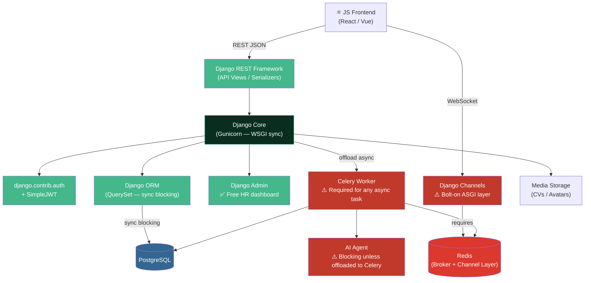

> ⚠️ **With a JS frontend, Django's template engine is unused.** DRF adds boilerplate and CHANNELS is a complex bolt-on — the original monolith advantage erodes.

### FastAPI (Async API + Native WebSocket + AI Agents)

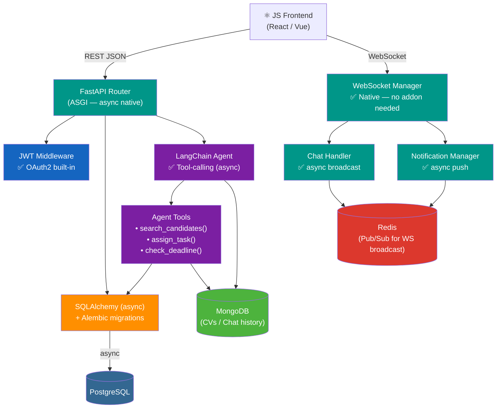

> ✅ **With a JS frontend**, FastAPI acts as a pure async API + WebSocket server. No templates, no Celery needed for AI tasks — everything runs in the same async event loop.

---

## 2. Real-Time Chat & Notification Flow

This is where the architectural gap is most visible for this project.

### Django (Channels — bolt-on complexity)

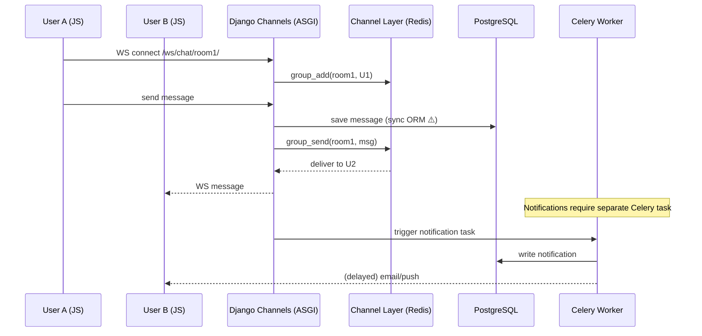

### FastAPI (Native async WebSocket)

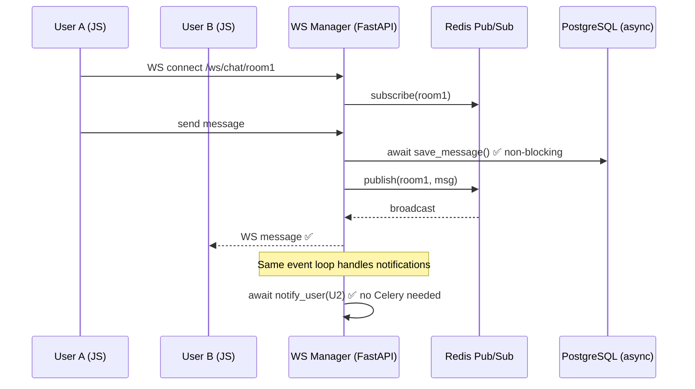

---

## 3. Interactive AI Agent Flow (Tool-Calling)

The project requires an AI that can call internal functions — e.g. fetching candidate scores, assigning tasks, querying deadlines.

### Django (Celery-based — indirect)

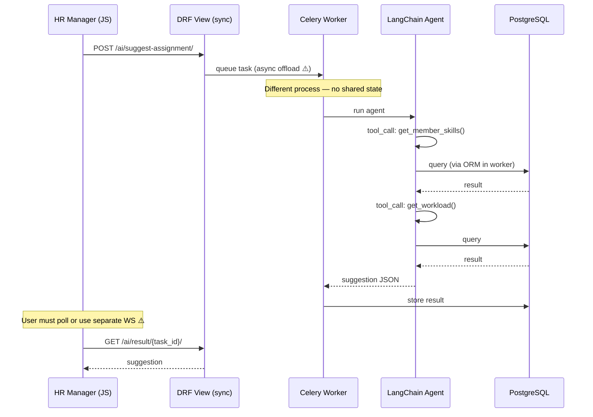

### FastAPI (Native async — streaming capable)

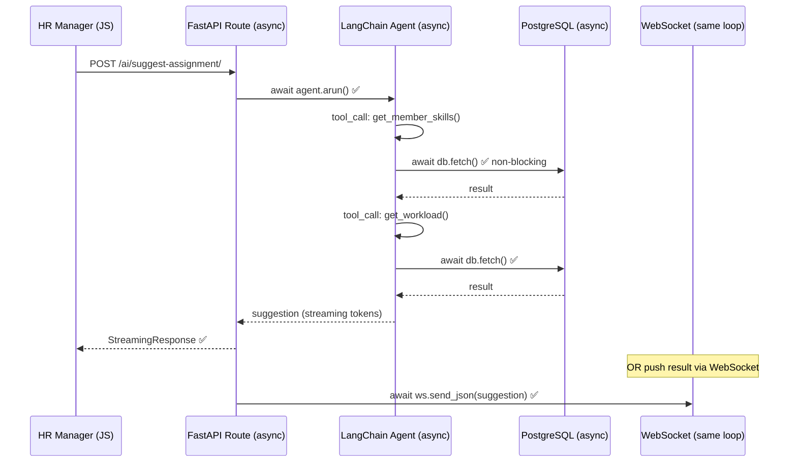

---

## 4. Feature Matrix (Given Project Constraints)

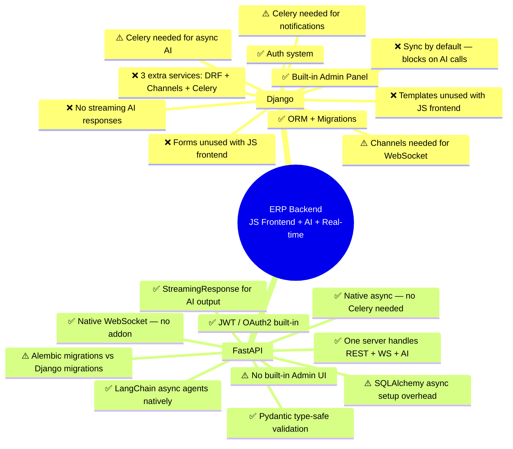

---

## 5. ERP Module Fit Analysis

### Hiring Module

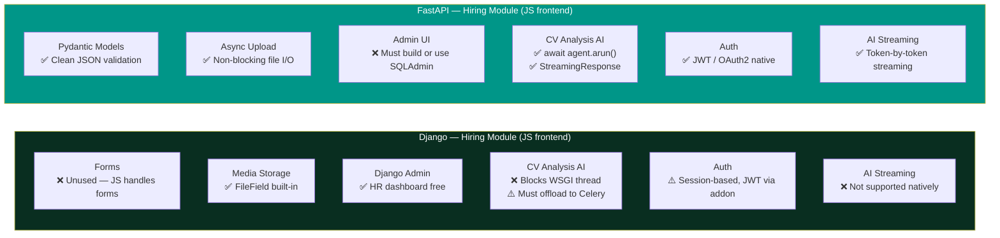

### Projects Module

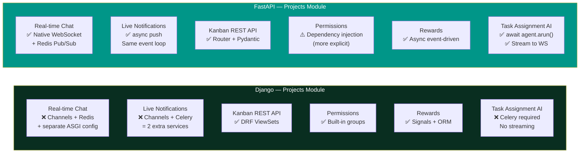

---

## 6. Concurrency Model — The Core Difference

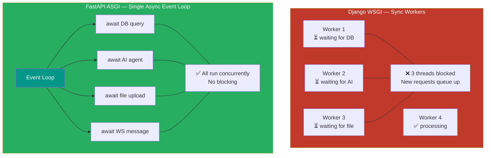

> For an app with simultaneous **AI calls + WebSocket chat + file uploads**, a sync WSGI server exhausts its thread pool quickly. ASGI handles all concurrently in one process.

---

## 7. Infrastructure Complexity Comparison

How many services does each stack need to deliver all features?

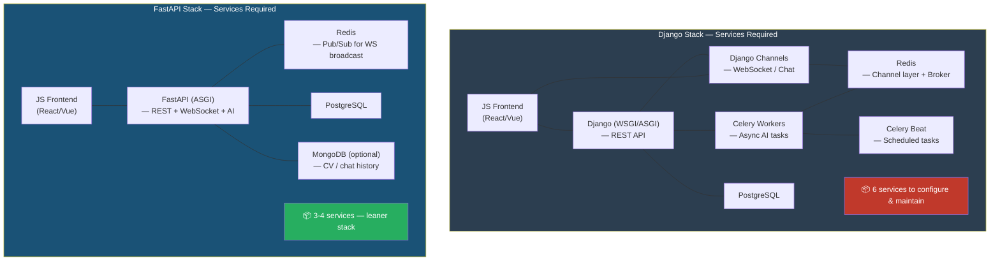

---

## 8. Developer Experience — Magic vs Explicit

This is the criterion that matters most for "smooth running + no unexpected bugs + beginner-friendly".

### Django: Implicit Magic (opinionated, hidden wiring)

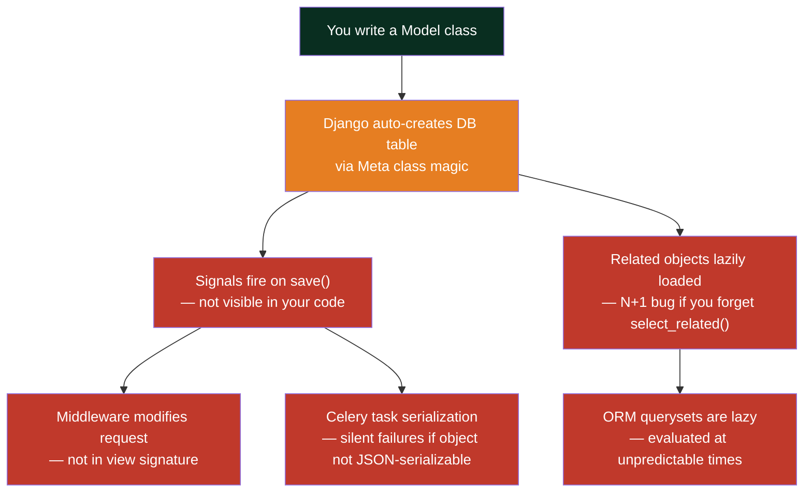

### FastAPI: Explicit Everything (non-opinionated, what-you-see-is-what-you-get)

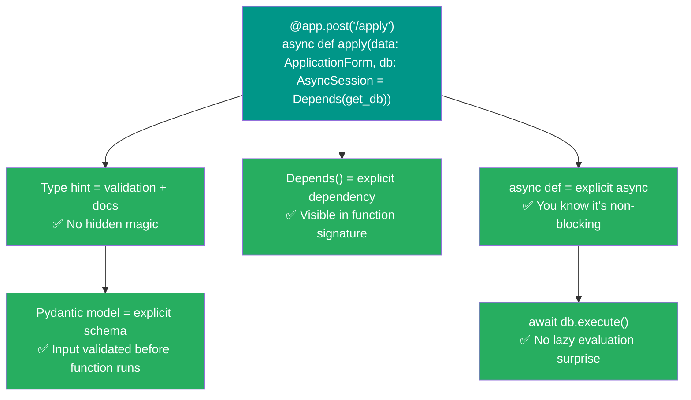

---

## 9. Common Foot-guns & Unexpected Bugs

### Django foot-guns in this project's context

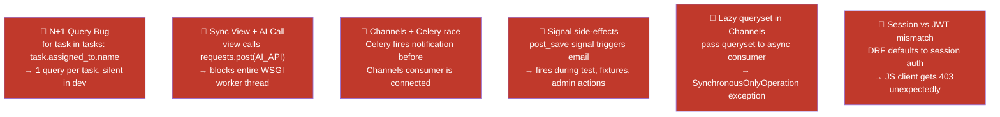

### FastAPI foot-guns (fewer, more visible)

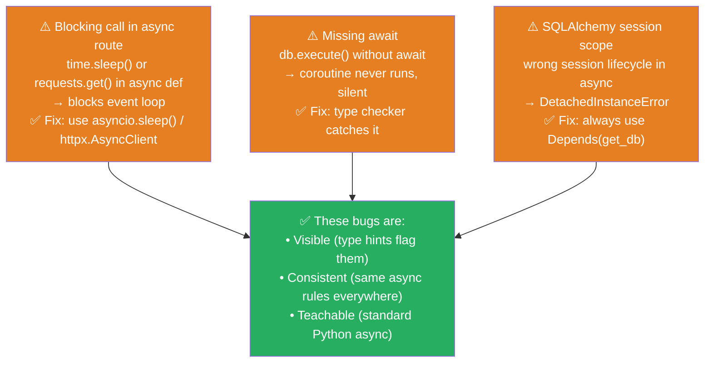

---

## 10. What Each Framework Teaches You

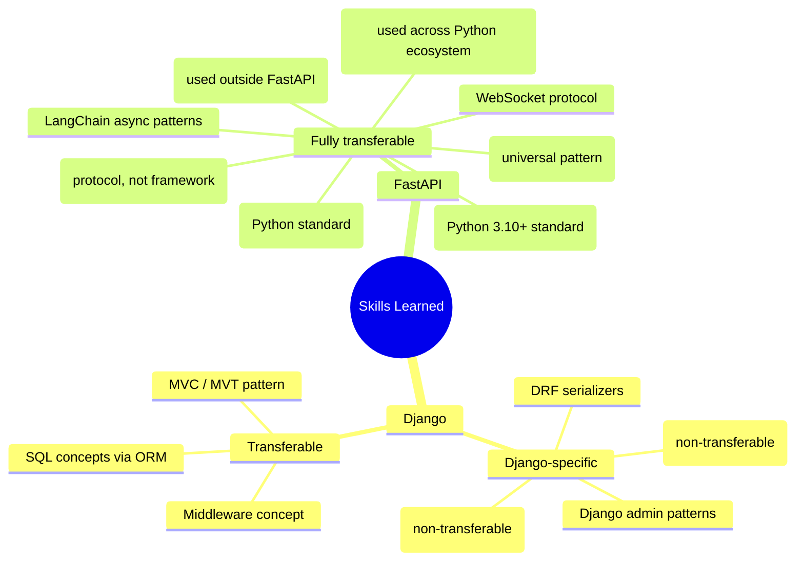

> FastAPI forces you to learn Python itself (type hints, async) and universal patterns (DI, JWT, WebSocket) — not framework-specific magic.

---

## 11. Architectural Decision — This Project

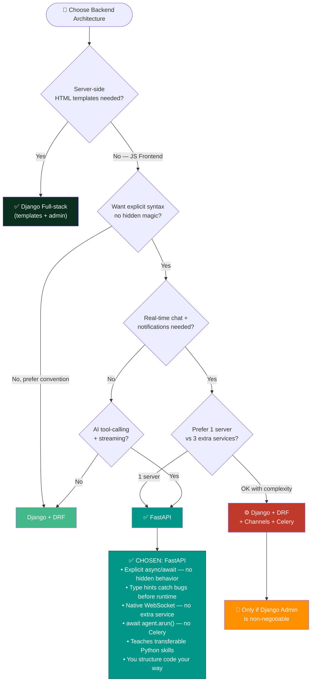

---

## 12. Final Verdict — Given All Constraints

| Criterion | Django + DRF + Channels | FastAPI | Weight |
|---|---|---|---|
| Explicit, readable syntax | ❌ Magic: signals, lazy ORM, Meta | ✅ Every dependency visible | **Critical** |
| No unexpected bugs | ❌ N+1, SynchronousOnlyOperation, signal fires | ✅ Type hints prevent most at write-time | **Critical** |
| Real-time Chat (WS) | ❌ Channels addon + Redis | ✅ Native + Redis pub/sub | **Critical** |
| Live Notifications | ❌ Channels + Celery required | ✅ Same async loop | **Critical** |
| Interactive AI w/ tools | ❌ Celery offload, no streaming | ✅ `await agent.arun()` + streaming | **Critical** |
| Teaches transferable skills | ⚠️ Mostly Django-specific patterns | ✅ Python async, DI, SQLAlchemy, JWT | **High** |
| Not opinionated | ❌ MVT enforced, specific app structure | ✅ Structure freely | **High** |
| Infrastructure simplicity | ❌ 6 services | ✅ 3-4 services | **High** |
| Async I/O | ❌ Blocking WSGI by default | ✅ ASGI native | **High** |
| Built-in Admin UI | ✅ Excellent | ⚠️ SQLAdmin lib | Low |
| ORM & Migrations | ✅ Built-in | ⚠️ SQLAlchemy + Alembic | Medium |
| Time to first route | ✅ Faster | ⚠️ Async setup overhead | Low |

### Score (all constraints included)

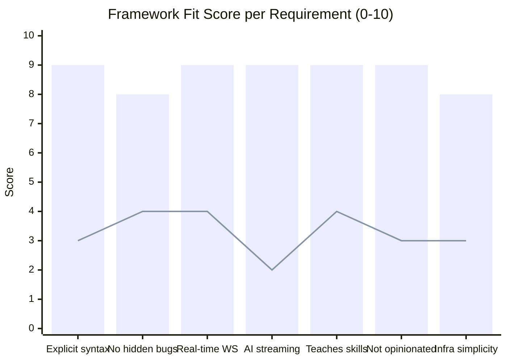

> 🟦 **Bar** = FastAPI | 🟧 **Line** = Django+Channels+Celery

---

> **Conclusion:**
> Django is opinionated, magic-heavy, and requires 3 bolt-on services (Channels, Celery, Beat) to match FastAPI's built-in async capabilities.
> When something breaks in Django's async stack, the cause is often invisible — split across signals, middleware, and task queues.
>
> FastAPI is explicit by design: every dependency is declared, every async call is visible, type hints catch mistakes before they run. Its bugs are Python bugs — learnable and searchable. Its patterns (async/await, DI, Pydantic, JWT) are transferable across the entire Python ecosystem.
>
> **Chosen architecture:** FastAPI (ASGI) + SQLAlchemy async + Alembic + Redis (Pub/Sub) + PostgreSQL + MongoDB (CVs/chat history) + React/Vue frontend.
