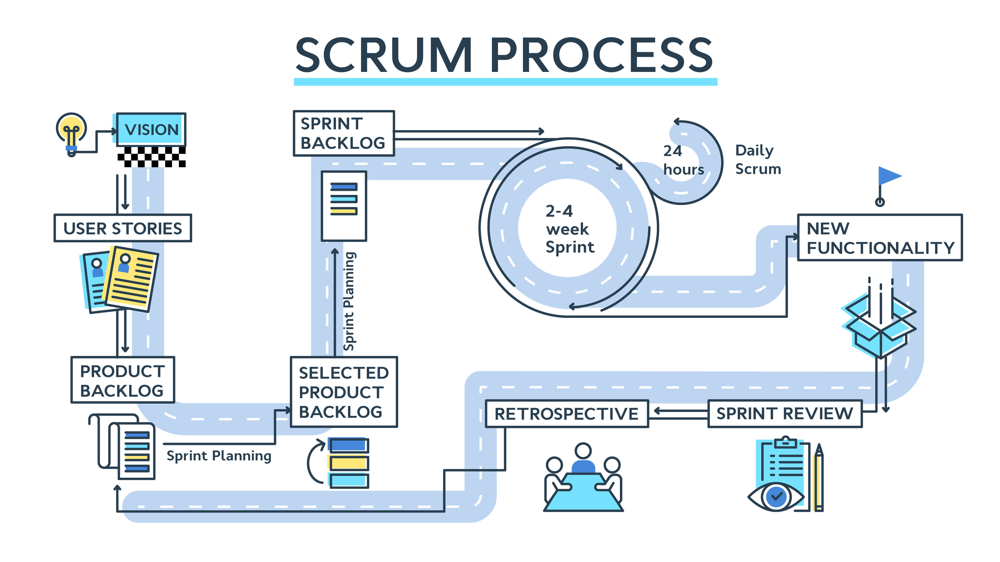
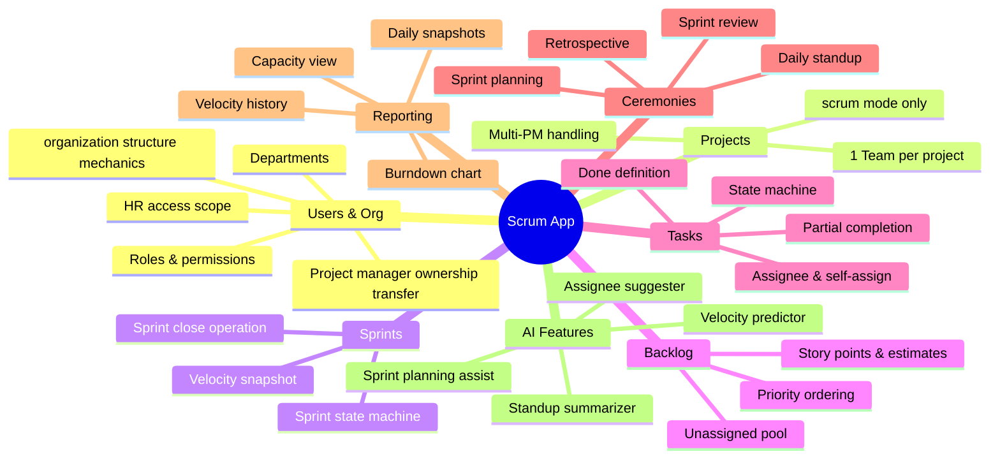

# cahier de charges summary

## hiring
- [x] HR manager can create job postings
- [x] condidats can apply for job postings via a web form
- [x] resumes are stored
- [x] AI will analyse resumes and rank candidates based on qualifications
- [x] HR manager can review ranked candidates and schedule interviews

## project management
every project has tasks, deadlines, and tasks have assigned team members.
### task management

- [x] show who is assigned to each task in task view
- [x] show tasks assigned to each team member in members view
- [x] allow team members to update task status and add comments
- [x] send notifications to team members when tasks are updated or deadlines are approaching
- [x] allow project managers to reassign tasks and adjust deadlines as needed
- [x] reward team members with points for completing tasks on time
- [ ] proper permissions system with roles (admin, manager, employee)
    - [x] rh and admin can manage accounts
    - [x] kanban permissions (only the concerned who shall update the task status)
    - [ ] scrum (in progess)

- [x] AI suggests task assignments based on team members' skills and workload

- [x] chaque employé a un profil avec ses compétences et son historique de travail

| What                                   |     Why it matters for thesis      |
| -------------------------------------- | :--------------------------------: |
| ML models as LLM tools                 |    Core thesis argument (maybe)    |
| Agentic loop with multi-tool reasoning |    Shows i understand agents     |
| Bulk resume appraisal                  | Showcases the ML pipeline at scale |

# features

## AI
<!--  -->

## dev

### high priority

- [ ] scrum
    - [x] sprint stories (no epics)
    - [ ] sprint burndown chart
    - [ ] kanban for current sprint
    - [x] backlog management with drag and drop to sprints
```
Product
    │
    ├── Product Backlog
    │   └── Stories
    │       └── Tasks
    │
    └── Sprints
        └── Sprint Backlog
            └── Stories
                └── Tasks
```

**scrum process:**
- product backlog (user stories)
- loop:
    - sprint planning: move stories from backlog to sprint, break into tasks, assign
    <!-- - daily standup: update task status, blockers-->
    - sprint review: demo completed work, gather feedback
    - sprint retrospective: discuss what went well and what can be improved





### medium priority
- [ ] task status need refinement
- [ ] points must not be issued until sprint is completed

- [ ] wanna make UI feel interactive more like an editor than buttons and popup forms

- [x] editable dahsboards
    - [x] colspan and rowspan for charts
    - [x] dry

- [ ] resume bulk appraisal for a job posting
- [ ] assignment suggestions should be integrated into the assignment component

### low priority
- @mentions in group chat and comments

# role permissions matrix

| Action                     | admin | hr_manager | project_manager | team_member |
| -------------------------- | :---: | :--------: | :-------------: | :---------: |
| View all users             |   O   |     O      |        X        |      X      |
| Edit user profile (own)    |   O   |     O      |        O        |      O      |
| Edit user profile (others) |   O   |     O      |        X        |      X      |
| Change roles               |   O   |     X      |        X        |      X      |
| Activate/deactivate        |   O   |     O      |        X        |      X      |
| Delete user (hard)         |   O   |     X      |        X        |      X      |
| Manage departments         |   O   |     O      |        X        |      X      |
| Create job posting         |   O   |     O      |        X        |      X      |
| View applications          |   O   |     O      |        X        |      X      |
| Create project             |   O   |     X      |        O        |      X      |
| Assign tasks               |   O   |     X      |        O        |      X      |
| View own tasks             |   O   |     -      |        O        |      O      |


project front end sructures: 
- pages
    - _common
        - navbar ...etc
    - admin
        - dashboard
        - components
    - hr
        - dashboard
        - components
    - project manager
        - dashboard
        - components
    - team member
        - das
    - chart registry
        


